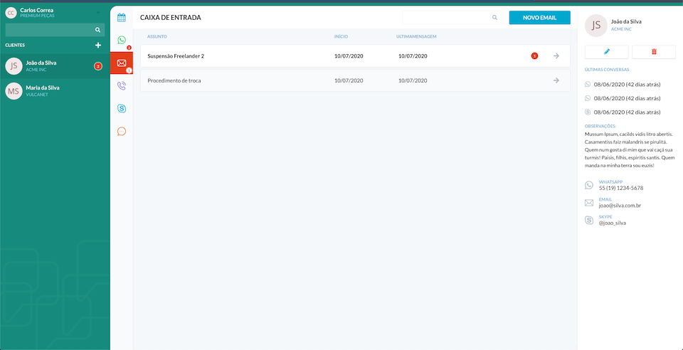
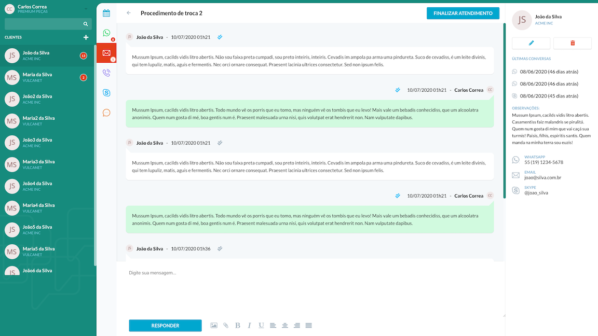

## VulcaNet peçaZap

Um dos Services as a Software ([SaaS](https://blog.deskmanager.com.br/o-que-e-saas/)) da VulcaNet é o [peçaZap](https://pecazap.com.br/). Nesta aplicação, o usuário consegue receber mensagens em vários canais de comunicação tudo em uma tela só.
Por exemplo, você cadastra seu número do WhatsApp, e-mail e Instagram e pode enviar e receber mensagens em todos esses meios sem precisar ficar gerenciando várias abas e contas.
Por isso, o peçaZap ajuda na agilização do atendimento ao cliente, fazendo com que você não perca venda para um concorrente que atenda mais rápido.

<p align="center">
  

  

  <a href="https://github.com/remulocosta/desafio2-frontend-vulcanet/commits/master">
    
  </a>

  <a href="https://github.com/remulocosta/desafio2-frontend-vulcanet/issues">
    
  </a>
</p>

<p align="center">
  <br />
</p>
<p align="center">
  <br />
</p>
<p align="center">
  <br />
</p>
<p align="center">
  <br />
</p>

## Para acessar a aplicação, Login:
'Preview da aplicação feito deploy no [netlify](https://desafio2vulcanet-remulo.netlify.app/) "https://desafio2vulcanet-remulo.netlify.app/"

- usuário:  carloscorrea
- password: carloscorrea


Este projeto foi iniciado com o [Create React App](https://github.com/facebook/create-react-app).

## :rocket: Technologies
- [NodeJS](https://nodejs.org)
- [ReactJS](https://reactjs.org/)
- [Axios](https://github.com/axios/axios)
- [VS Code][vc] com [EditorConfig][vceditconfig] e [ESLint][vceslint]

## :information_source: Como usar
Para clonar e executar este aplicativo, você precisará do Git , Node.js v12.x.x ou superior + Yarn v1.22.4 ou superior instalado no seu computador.<br />

```bash
# Clone este repositório
$ git clone https://github.com/remulocosta/desafio2-frontend-vulcanet.git front-end

# Vá para o repositório
$ cd front-end

# Instalar dependências
yarn install
```

### Todos os dados mostrados na aplicação são obtidos via API que disponibiliza os seguintes endpoints

altere o nome do arquivo [.env.example](https://github.com/remulocosta/desafio2-frontend-vulcanet/blob/master/.env.example) na raiz do projeto para .env depois modifique
a váriavel de ambinete REACT_APP_API_URL para a url do servidor, se necessário.

○	[/customers](https://my-json-server.typicode.com/matheuscampanhaf/api-challenge/customers)<br />
○	[/customers](https://my-json-server.typicode.com/matheuscampanhaf/api-challenge/contacts)<br />
○	[/chats](https://my-json-server.typicode.com/matheuscampanhaf/api-challenge/chats)<br />
○	[/user](https://my-json-server.typicode.com/matheuscampanhaf/api-challenge/user)

caso os endpoints não estejam mais disponíveis, defina o valor REACT_APP_API_URL para http://localhost:3333
e execute o servidor fake com [json-server](https://github.com/typicode/json-server)

### Na sua linha de comando:

```bash
## abra uma nova linha de comando  na raiz do projeto e execute
$ yarn json-server vulcanet-db.json --host localhost  -p 3333

## o servidor fake será finalizado caso feche a linha de comando.
```


### Para executar a aplicação:
```bash
# No diretório do projeto, você pode executar:
$ yarn start
```

Executa o aplicativo no modo de desenvolvimento.<br />
Abra [http://localhost:3000](http://localhost:3000) para visualizá-lo no navegador.

A página será recarregada se você fizer edições.<br />
Você também verá lint dos errors no console.


### `yarn build`

Cria o aplicativo para produção na pasta `build`.<br />
Ele agrupa corretamente o React no modo de produção e otimiza a construção para o melhor desempenho.

A compilação é minificada e os nomes de arquivos incluem os hashes.<br />
Seu aplicativo está pronto para ser implantado!

Consulte a seção sobre [deployment](https://facebook.github.io/create-react-app/docs/deployment) para obter mais informações.

## Saber mais

Você pode aprender mais na documentação do [Create React App documentation](https://facebook.github.io/create-react-app/docs/getting-started).

Para aprender o React, consulte a [React documentation](https://reactjs.org/).

---

Feito com ♥ por Remulo Costa 👋 Entrar em [contato](https://www.linkedin.com/in/remulocosta/)!
